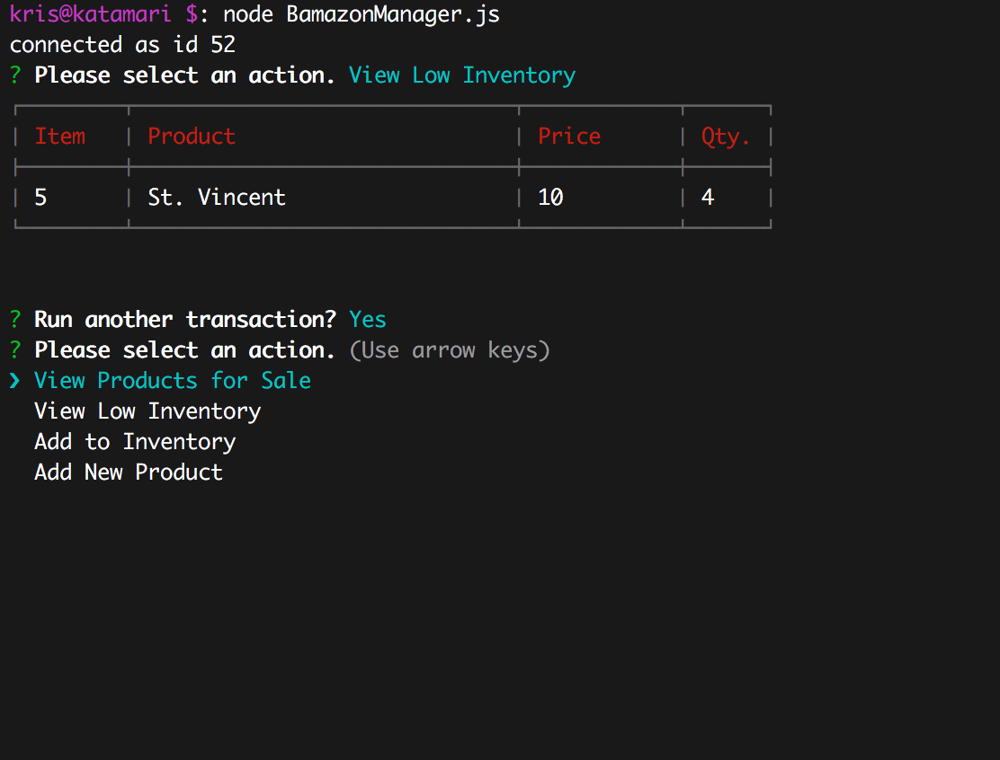

# BamazonDB

(MySQL, Node.js) A customer- and business- facing command line storefront that updates user transactions in multiple tables.

It was neat thinking through different user perspectives for this one. I added confirmation prompts after each update transaction because I know that's how it would be in real life. I also found a way to put read queries into a function that took in the required columns and a callback as parameters. Finally, I tried to add a little data validation via regex in the Manager file.

I wound up using the Prompt and Inquirer modules, because the Bamazon Customer spec said to use Prompt, but I needed the ability to list options for the Manager and Executive specs, which I did not read until I was finished with Bamazon Customer -_-. 

[Youtube demo](https://www.youtube.com/watch?v=Bp788k2MFpI)

